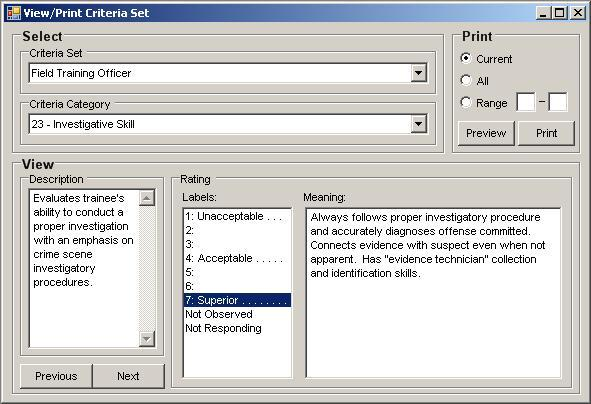
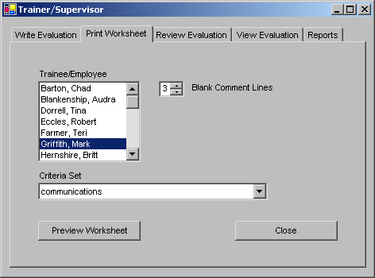
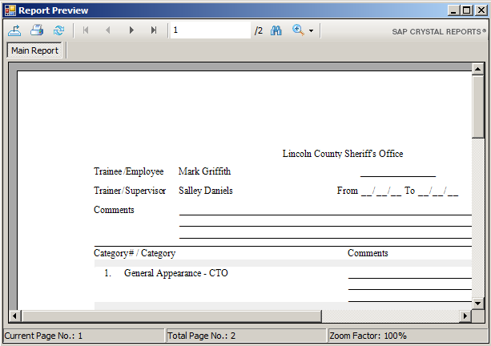
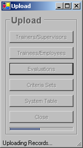

# Expectations Trainer Tools and Utilities

## Trainer/Supervisor Tools and Utilities

***

* View/Print Criteria Set Form
* Trainer/Supervisor Form
* Download
* [Upload](expectations-trainer-tools-and-utilities.md#upload-form)

## View/Print Criteria Set Form

***

The View/Print Criteria Set form allows existing criteria sets to be reviewed and printed. To bring up the form, select the Trainer/Supervisor - View/Print Criteria Set menu item on the [main form](broken-id-3znysh7).

.jpeg>)

The View/Print Criteria Set Screen is framed into three areas which are labeled Select, View and Print.

Inside the Select frame are controls used to select the criteria set and criteria category to be viewed or printed. The Criteria Set combo box is used to select the desired criteria set from a list of all the available criteria sets. Once a criteria set is selected the Criteria Category combo box is loaded with all of the criteria contained in the set from which one can be selected.

Information for a selected criteria is displayed in the Description text box located in the View frame. Upon selecting the criteria's various rating labels in the Rating frame, any corresponding meaning that may be supplied will appear to the right. The Previous and Next buttons are provided to navigate sequentially through the criteria contained in the set.

Located inside the Print frame are controls used to select and print criteria. The option buttons and range boxes are used to indicate the criteria to be printed. To print the currently displayed criteria select Current. Select All to print all the criteria from the set shown in the Criteria Set combo box. A range of criteria from the current set can be printed by selecting the Range option and entering the first and last category numbers in the range boxes. When valid criteria and print selections have been made the Preview and Print buttons are enabled. Use the Preview button to preview the criteria to be printed and the Print button to print the report.

## Trainer/Supervisor Form

***

The Trainer/Supervisor Form provides utilities for writing new evaluations, printing blank worksheets for trainees, reviewing and viewing existing evaluations written by trainers, and printing formatted reports. It consists of the following five tabs:

* Write Evaluation
* Print Worksheet
* Review Evaluation
* View Evaluation
* Reports

##

#### **Trainer/Supervisor Form: Write Evaluation Tab**

***

The Trainer/Supervisor form Write Evaluation tab is accessed via the Trainer/Supervisor - Write Evaluation menu item on the [main form](broken-id-3znysh7).

.jpeg>)

The Write Evaluation tab displays a list of trainees/employees for which the current user can write an evaluation. This may include all trainees/employees if the current user is assigned to ['Department ALL'](broken-id-37m2jsg). An asterisk (\*) denotes that one or more incomplete evaluations exist for the trainee. The evaluation criteria set is shown in the drop down selector below the Trainee/Employee list.

.png>)

To write an evaluation, first select a trainee/employee. This done, the default criteria set is automatically entered, any incomplete evaluations are displayed, and the Write Evaluation button is enabled. The criteria set can be changed at this time, if desired, by making another selection from the drop down list. Clicking on the Write Evaluation button without selecting an evaluation opens the [Evaluation Writer](broken-id-sqyw64) with a new evaluation. To edit an existing evaluation, first make a selection from the Incomplete Evaluations list. The list entries are sequentially numbered and are sorted by the evaluation end date. Once an evaluation is selected, the criteria set is automatically entered and cannot be changed.

Clicking the Close button will close this window.

##

#### **Trainer/Supervisor Form: Print Worksheet Tab**

***

The Trainer/Supervisor form Print Worksheet tab is accessed via the Trainer/Supervisor - Print Worksheet menu item on the [main form](broken-id-3znysh7).

.jpeg>)

To print a worksheet, first make a selection from the list of trainees/employees available to the user. This list may include all trainees/employees if the current user is assigned to ['Department ALL'](broken-id-37m2jsg). Once selected, the default criteria set for the trainee/employee is entered into the Criteria Set box. This is the criteria set that will be used to create the worksheet. To change the criteria set, make another selection from the drop down list. The Blank Comment Lines counter varies the number of blank lines appearing for each comment. Selecting the Print Worksheet button loads the worksheet into the Report Preview window. Clicking the Close button closes the Trainer/Supervisor window.

Use the Report Preview window to check out the worksheet and make adjustments before printing. Selecting the Print Report button, having an image of a printer on the face, opens a Print dialog window from which the printer is selected and the document finally printed.

##

#### **Trainer/Supervisor Form: Review Evaluation Tab**

***

The Trainer/Supervisor form Review Evaluation tab is accessed via the Trainer/Supervisor - Review Evaluation menu item on the [main form](broken-id-3znysh7).

, the [Trainee/Employee Evaluation tab](broken-id-3cqmetx), and the Reviewer Comments tab. Operation of the first two tabs is the same as on the [Evaluation Viewer](broken-id-2dlolyb). They are used by the reviewer to look over the evaluation. After the evaluation has been checked, any comments the reviewer might have are entered on the Reviewer Comments tab. It includes the "Comments" (read-only) and "New" (editable) textboxes, as well as options for approving and disapproving the evaluation. Use the Spelling button to spell check the comments before submitting. Select the Submit button after the comments have been entered and the approval state has been set:

 when it is sent back for correcting, the Evaluation Viewer once approved by all reviewers, and in the evaluation report preview and print-off when configured to do so from the [Reviewer Comments](broken-id-4bvk7pj) sub-tab.

## NOTE: Until all reviewers have approved the evaluation, or unless turned off in the [Unapproved Evaluations](broken-id-2r0uhxc) configuration sub-tab of the Global Settings tab, DRAFT will appear across each page of the report when printing or previewing.

***

The Signatures tab will appear in the Evaluation Reviewer to allow an evaluation to be signed by the reviewer when the "Allow completed evaluations to be signed before they are fully-reviewed" checkbox is checked (in the [Signatures](broken-id-1664s55) sub-tab of the [System Utilities](broken-id-2xcytpi) form's [Global Settings](broken-id-46r0co2) tab).

## NOTE: If the "Allow completed evaluations to be signed before they are fully-reviewed" checkbox is checked , a confirmation prompt will appear for reviewers when they disapprove evaluations. Choosing 'Yes' at the following prompt will cause all existing signatures to be cleared and the Signatures tab to disappear, since the evaluation is no longer in the 'Complete' state:

***

## Trainer/Supervisor Screen: View Evaluation Tab

***

The Trainer/Supervisor form View Evaluation tab is accessed via the Trainer/Supervisor - View Evaluation menu item on the [main form](broken-id-3znysh7).

 will appear with the selected evaluation. Clicking the Close button will close this window.

## NOTE: If the "Prevent unapproved evaluations from appearing in the View Evaluation tab until fully-reviewed" checkbox is checked, all evaluations written by trainers/supervisors who have one or more assigned reviewers must be fully reviewed in order for those evaluations to appear in the View Evaluation tab. The "Prevent..." checkbox may be found in the [Unapproved Evaluations](broken-id-2r0uhxc) sub-tab of the [Global Settings tab](broken-id-46r0co2).

***

## Trainer/Supervisor Screen: Reports Option

***

The Trainer/Supervisor form Reports tab is accessed via the Trainer/Supervisor - Reports menu item on the [main form](broken-id-3znysh7).

* [Trainee/Employee Roster](broken-id-25b2l0r)
* [Trainer/Supervisor Reports](broken-id-kgcv8k)
* [Trainee/Employee Reports](broken-id-34g0dwd)
* [Training Time Report](broken-id-1jlao46)

.png>)

Select the type of report to be viewed and then click the View Report button. Clicking the Close button will close this screen.

## Download Form

***

The Download form allows information entered at one workstation to be saved to an external file for the purpose of transferring to another workstation. It provides users that do not have network access the ability to maintain a [centralized database](broken-id-3dy6vkm). To bring up the Download form select the Administrator - Download menu item on the [main form](broken-id-3znysh7).

 and the user's [security level](broken-id-3ygebqi). The tabs are labeled as follows:

* [Trainers/Supervisors](broken-id-206ipza)
* [Trainees/Employees](broken-id-4k668n3)
* [Evaluations by Trainer/Supervisor](broken-id-43ky6rz)
* [Evaluations by Trainee/Employee](broken-id-1egqt2p)
* [Criteria Sets](broken-id-2zbgiuw)
* [System Tables](broken-id-3l18frh)

## NOTE: Only those downloaded Zip files from a source database which is configured by the same Expectations version as the destination database are supported in the upload process. The source and destination databases may be either of the two database types in any combination of MS Access or SQL Server.

***

## Upload Form

***

The Upload form allows information entered and downloaded at one workstation to be transferred to another. It provides users that do not have network access the ability to maintain a [centralized database](broken-id-3dy6vkm). To bring up the Upload form select the Administrator - Upload menu item on the [main form](broken-id-3znysh7).

 and by the user's [security level](broken-id-3ygebqi). Security levels 1 and 2 are only allowed to upload evaluations. On a stand-alone system only trainers/supervisors, trainees/employees and criteria sets can be uploaded.

.png>)

To perform an upload select the type of upload to perform. An Open window will appear. Use the Open window to locate and select the file containing the data to be uploaded. Click on the Open button to start the upload. An incorrect file type selection will result in an error dialog. To abort the upload select Cancel.

.jpeg>)

During the upload a progress bar appears at the bottom of the window to indicate the status. Notification appears on the screen when when the upload is completed. Attempting to close the form while an upload is in progress will bring up a dialog box, offering the operator an opportunity to abort.

> NOTE: Only those downloaded Zip files from a source database which is configured by the same Expectations version as the destination database are supported in the upload process. The source and destination databases may be either of the two database types in any combination of MS Access or SQL Server.

***

> WARNING: Changing the system type to permit uploads other than those normally allowed by the software may result in loss of data!

***
